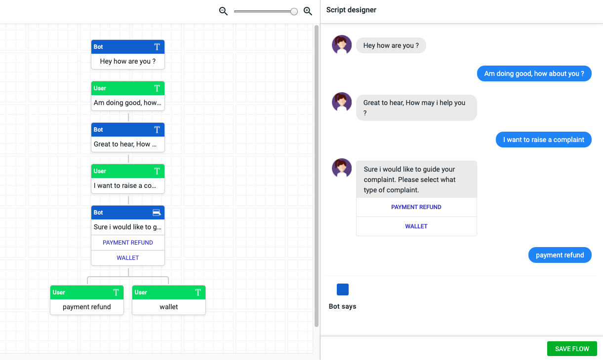

Today we pushed flow bot feature inside [yekaliva](https://yekaliva.ai/). Where a user can create and integrate the flow bot using our new flow bot builder inside our [product](https://yekaliva.ai/). It's a superb simple conversational and dataflow UI easily helps users to create flow bot and attach it to the existing FAQ.  

## Why ?
After we push widget UI/UX design to production and did a test [marketing](https://karthyk.dev/writings/tags/marketing) over our existing customers, partners, and our network. We were surprised and excited to get new queries from them stating that our chatbot platform helps to create a FAQ bot ( eventually the don't know about the engineering behind understanding user queries). No, Don't think that way I am not against that, Instead, i was took note of the things which the were asking, I have mentioned it as list

- Bot response needs to be more interactive with response types like image carousel, videos, GIF's, etc
- Set rules for a bot, to focus or pull the customer to a narrow path
- Integration with social mediums and other SAAS products 
- API integration
- Templates

All the above features are more important, I was starting to prioritize the list and focus on one. As I started to gather information and products that are already in the market that does flow bot. I came to know that most of the chatbot platform was only using flow bot as there main product and adding faqs as there module using simple ML. On the other hand we spend a nearly huge amount of time getting deeper inside on a built engine that can able to solve and answer back any complex queries too. I understood the difference between the research product and market fit product. 

Yes our [product](https://yekaliva.ai/) was way ahead of those thousand of flow bot products available inside the market. But since the market condition and our customers are looking for a flow bot. We need to work on that as the main priority. 

## How ?
While going through many products I was little impressed by [flowXO](https://flowxo.com/) and [gupshup](https://www.gupshup.io/). Especially gupshup, I love the way they have made there flow bot-building platform that can make the user understand how and show how the conversation flow and how it's structured that connects with other flows. I am talking mostly from the UX/UI perspective only. 

### Misleading
As a product developer, I need to take up this as a challenge. Wait we have a major drawback in order to build this system and integrate with our existing engine. I had a conversation with my founder, about why not we build this product separately with a one-month deadline. Since we need to dig lots of stuff that needed to be changed inside the engine, if not planned it might be a huge time loss for us. But he without even thinking about the complexity, He acted as a boss and asked me to do it whatever it takes.

Me with one intermediate and one junior developer had a lot of thoughts running over my mind about how to convey this big picture to the team, how not to think about the problems that the will undergo while building this flow system. I came up with a plan  
- Understand how gupshup client is build
- Create a schema and build UI
- Integrate inside the [product](https://yekaliva.ai/)

### Understand how gupshup client is build
This was quite a challenging one. I created an account inside gupshup and opened my partner in crime ( chrome developer console ) started to see how the template is created. Being a front end developer and built a SAAS [product](https://yekaliva.ai/) alone, taught me the fastest way to build layouts. I designed the design elements and CRUD functionalities on the back-end first. I was not a common thinker of algorithms. 

While inspecting the gupshup flow previewer deeply understanding what is happening over it. To my luck I found out they have an object which contains an array that has all the questions that are created. After analyzing the schema structure. I came to the conclusion that this looks like a TREE, my mind strike back to my college and school days where I learned about Types of trees in Data structure. OOP! I am not so good at it.  

### Create a schema and build UI
I started to work on it with vanilaJS parallelly understanding about data structure. It took me two days to be comfortable with what was doing. At last, I sketch a simple js file, in which it does these operations
- Create a root node
- Insert a child node by giving the parent node id
- Update a node 
- Delete a node
With simple schema that contains id, parent_id, data. I did it. So it made my work simple to re-construct the structure according to our chatbot previously defined schema. Coming to create UI for previewer as you can see on the above image left side. 

I was going through lots of Tree viewer libraries, every library doesn't give much customization. So I build one from scratch. I learned a lot of things while building.

### Integrate inside the product
After creating the schema structure and gave it to the model team and explained the structure and what is the functionality that will be needed when a user starts with a flow-based question. I have demonstrated the flow below

- User query =>  Bot Engine [ understand the type of question and response them] 
- if response type === flow, a flag should be raised on the model stating that flow is active
- Further queries after that will be mostly based on quick replies and canned response type from user
- By checking the status and node of flow the response will be send back to User
- if flow ended, flags is set to inactive
- if a user breaks or leave the chat, after few minutes of no response it should send thanks response and make the flow inactive and once the user is back it will automatically be based on the history of incomplete response it will ask the user to continue or drop 

By giving a clear clarity about what needs to be done and the scenarios that model team needs to be considered. The started working and gave a version of output that works. We went through the further testing process and updated it in our sandbox to give to our friends to test the flow bot builder. As usual we ended up with mysterious errors and bugs that took us a week to fix. Then we gave another round to new people to test. We got a few minor bugs that don't require much concentration on it. 

With a much hardwork and great excitement we pushed the feature to production and emailed our partners and customers about the new feature. [Yekaliva’s](https://yekaliva.ai/) AI chatbot lets your visitors and customers experience truly revolutionary service without needing constant human engagement.

