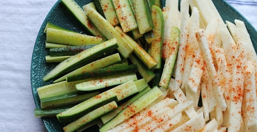

I was in my second year back in 2011 was doing B.Tech I.T in a college nearby Chennai. It was one of my dreams to be a part of the NSS team during my school days, unfortunately, I wasn't a part of the NSS team due to academic reasons. But time has its way of giving a chance, Yes, I had the opportunity to join in NSS team in my college. 

### NSS Team
We were around nearly 50 people, planning to do a camping activity in one of nearby village 15Km from our college. We have to say there for 15 days. And get along with the village people, learn how their daily life will be. And also we learned and did lots of other activities I will explain in another blog. Let me get straight to one such activity which I personally excited to.

### Business Activity
We were separated into 8 teams, each team has a leader. As a part of E-cell(The Entrepreneurship Cell) activity, each team should invest Rs.50.00( INR ).

### Objective
It is a  24hr activity, We need to invest the initial money in any kind of business. At the end of the day, we need to show the profit you made. The activity was initiated at 6:30 pm will be active till the next day at 6:30 pm. It's started


### The Business plan
We are a team of 5 went to a nearby tea shop in that village, we had a brainstorming conversation about what can we do. Here is the list of ideas we came up with.
- Small Tiffen center
- Snack shop
And so on, But we realize that it needs lots of things to get started. For example, to start a small tiffin center, we need lots of equipment like a gas stove, a person who knew cooking and utensils. So we started to validate it with the availability.

Strategy
Instead of analyzing the negative part, we started to discuss what are the possibilities of being in a village and with only Rs.50 in hand. We found out an interesting thing. The day the choose this activity allowed us to work on the idea. Do you want to know what day it was? It's a sports day at the school where we use to stay at night. 

This gave us an idea to think about while putting us in the shoes of the students what the will be needing. Some of the interesting things that we came up with. Since it's summer, a typical sports day drains the athletes, cheering students, organizers which also including us and teachers. 

### Challenges 
The only challenge was choosing the right type of idea that needs to be
- Small investment
- It should be needy
- Less pricing modal
- Better returns

### Cucumber Shop
So we choose to sell "cucumber" or "mango" but don't know whether this village plant these fruits. It is the seasonal fruits and vegetables. We went for a walk in the village enquiring about what kinds of fruits the plant and also asking about who does unfortunately the showed a person who does cucumber plantation. We reached him started to engage about how much we get for Rs.40. He said I will give a half bag of cucumber which also includes wastages. We were discussing it later on purchased it for Rs.35. Now 

Investment - Rs.50
Purchased cucumber - Rs.35

Now we have something to sell, which is a seasonal vegetable and can be eaten raw and also cools our body, especially a healthy one. We started to head back to our room, counting how many cucumbers we have in hand and how much is the wastage and also purchased salt and chili powder.

Chilli powder - Rs.5
Salt - Rs 5

We got a cup from a nearby neighboring house to mix the salt and chili to give a flavor.



Execution
After separating the vegetable we have 25% of wastage. 75% is a good state that counts around 40. The day came to execute our business model. We chose a place where there is enough space for people to stand in the shade from the sun. We knew that people will love to have cucumber in summer. We sliced a single cucumber into 4 pieces I have added a picture for reference. Each piece we sold for Rs.1 / Rs.2 depends on the size of the piece. That's where our business model lies.
Just with a business model in hand, it's not going to make you any profit, it needs to be executed well too. So we came up a process as mentioned below
- One person will take care of who gave the money and how many customer needs
- Another person take care of cutting the vegetable into slices based on the demand and requirement
- Third-person responsible for adding the flavors and also refill the cup again
- Fourth and fifth are responsible to sell readymade cucumber on the go. 

We tried and believed in one idea and experimented in two ways. Going to the customer and Building a business where a customer needs a temporary break from the sun. Unfortunately, we sold all the 40 cucumbers some were sliced to 4 and somewhere sliced to 5. 

We didn't expect that our business was at a peak, all the cucumber were sold in 2hours. But the sports day wasn't over yet. Still, we are in the business but nothing to sell what we have is the profit we got by selling 40 cucumbers. To say it in numbers we made a profit of about Rs.356 + initial investment of Rs.50. That's nearly 700% return on investment. 

Second business model
Now we have money to invest in lots of things we can come up with. But again we had a rapid discussion about what's next. Suddenly we came up with an idea to open a lemon juice shop. Again we send two of the people to check and purchase the availability of lemon plantation in the village. 

We are just waiting patiently for the response from those 2 people who went. That was great news for us. Since we gave them Rs.50 to purchase if it is available. The again returned with a half bag of lemons. That's are huge. 

We need a big utensil to make the juice, One person in our team took that job of making the juice. Again we are not experts in that, we need to agree with that. It's a kind of trial we made in the first run with real customers.

The process we followed to make the juice. In this process, each took ownership to accomplish one single vision that will be shared among us. 
- One took the responsibility of getting utensil and cleans the water from well with filtration method the people use
- Two people took care of slicing the half bag of lemon 
- One people took care of squeezing the lemon inside the utensil
- One responsible for stirring the juice adding nannari sharbat and watching out the taste of the juice. 

We didn't fix any pricing model. We just invested in something we are trying out. At one point the person who tastes says to stop adding and slicing a lemon. Let's get this juice to the event. Wait wait. We forgot two major thing 
1. How we are going to distribute the juice,  
2. How much we need to charge for. 
Then since we had money in hand we went to a nearby shop to get two packs of plastic glasses which holds 200 glass. To come up with a pricing model. We don't how to calculate it. We just kept as Rs.4 per glass.

Total Expense for Lemon Juice Business
Nannari sharbat - Rs.38
Lemon Rs.50
Sugar Rs.60

Now we head back to the same place where we did previous business but this time. The complete business is a readymade model. We just need to get the total no. of juice the customer need and then give them. So simple as that. At then we just sold 112 glass of juice that came up to a total of Rs.448 in revenue. That huge for us.

I just summed up the whole money process below
```
Investment - Rs.50 ( + )
Purchased Cucumber - Rs.35 ( - )
Salt - Rs.5 ( - )
Chilli powder - Rs.5 ( - )
Total Invested - Rs.40
In hand - Rs.10
```
After First Business

```
Revenue - Rs.406
Profit - Rs.356 + Rs.10 ( in hand amount ) = Rs.366
```
Second Business Investment
```
Purchased Lemon - Rs.50 ( - )
Nannari sharbat - Rs.38 ( - )
Lemon Rs.50 ( - )
Sugar Rs.60 ( - )
Total Invested - Rs.198
In hand - Rs.168
```

After First Business
```
Revenue - Rs.448
Profit - Rs.250 + Rs.168 ( in hand amount ) = Rs.418
```

So you may ask what we did with the remaining juice? We gave juice for free to our NSS teams as free. Because the were also trying the same way as what we did. Unfortunately at the end of the day. Everybody made a profit some didn't but everyone tried. We got the maximum revenue with happy customers. I don't want to say that I did the best. But what we at that particular scenario matters a lot.

This one single activity taught us a lot of things
- Commitment
- Sincerity and dedication towards what we do
- Taking the right idea to the given market
- Brainstorming
- Responsibilities
- Ownership
- Belive in process
- Execution
- Customer satisfaction 
- Fellowship

These are not just the keywords, Each and everything holds a strong action when coming to the business. I will share my experiences through my blog posts. 

